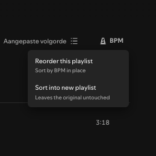

# Spicetify Sort BPM



DJ-style playlist tools for the Spotify desktop client, via [Spicetify](https://spicetify.app).

It sorts a playlist for mixing — **by BPM (tempo)**, or **by musical key on the Camelot
wheel with BPM ascending inside each key**.

A **BPM** button is added to the playlist action bar (between "Search in playlist" and the
sort/view button). Clicking it offers two destinations, each of which opens a submenu with
the two sort modes:

- **Reorder this playlist** — sorts the tracks in place. Preserves each track's
  "date added". Only works on playlists you own.
- **Sort into new playlist** — creates a new `"<name> (BPM)"` or `"<name> (Key)"` playlist
  and leaves the original untouched (works on any playlist).

Sort modes:

- **by BPM** — tempo, slowest to fastest.
- **by key + BPM** — Camelot order `1A, 1B, 2A, 2B … 12A, 12B`, then tempo ascending within
  each key. Relative minor/major pairs share a number (8A = A minor, 8B = C major), so this
  ordering keeps them adjacent and consecutive tracks are almost always harmonically
  mixable.

Tracks without the data the chosen mode needs (local files, podcasts, unavailable or
un-analyzed tracks) are moved to the end rather than being sorted into a wrong position,
and the count is reported.

> **Note:** the BPM and key values are read from the playlist's own **BPM** and **Key**
> columns, so the relevant column must be visible before sorting. If it isn't, enable it via
> the playlist's column/view settings (the "..." / column header menu). With the column
> hidden there is no data to read, and the extension says so rather than guessing.

## Development

```sh
npm install
npm run watch      # rebuild on change into the Spicetify Extensions folder
# or
npm run build:local  # minified build into ./dist
npm run typecheck
npm run lint
```

## Install (local)

```sh
npm run build:local
# copy dist/sort-bpm.js to the Spicetify Extensions folder:
#   macOS/Linux: ~/.config/spicetify/Extensions
#   Windows:     %appdata%\spicetify\Extensions
spicetify config extensions sort-bpm.js
spicetify apply
```
